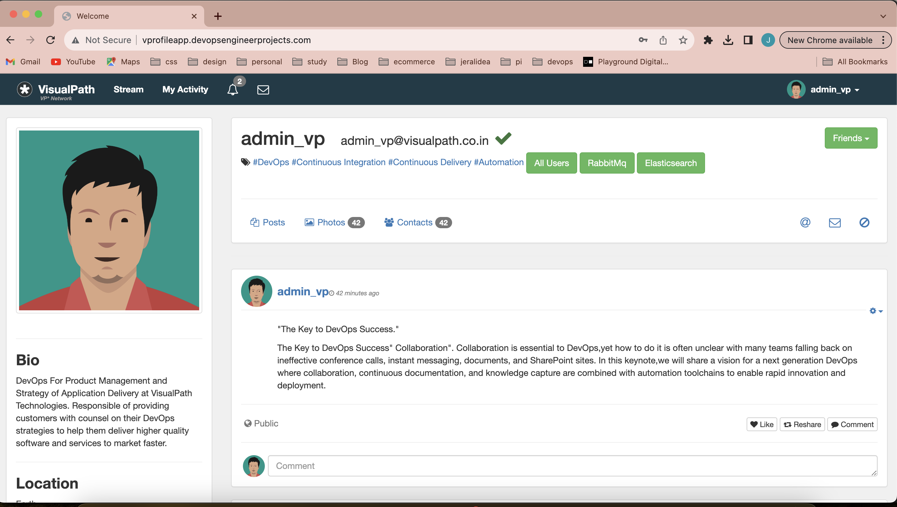
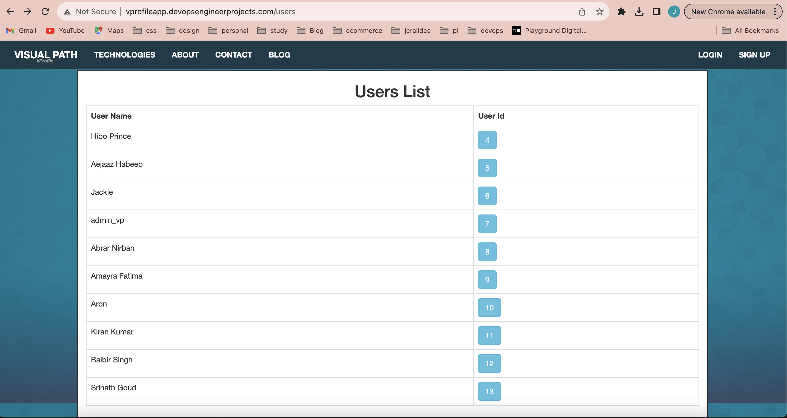
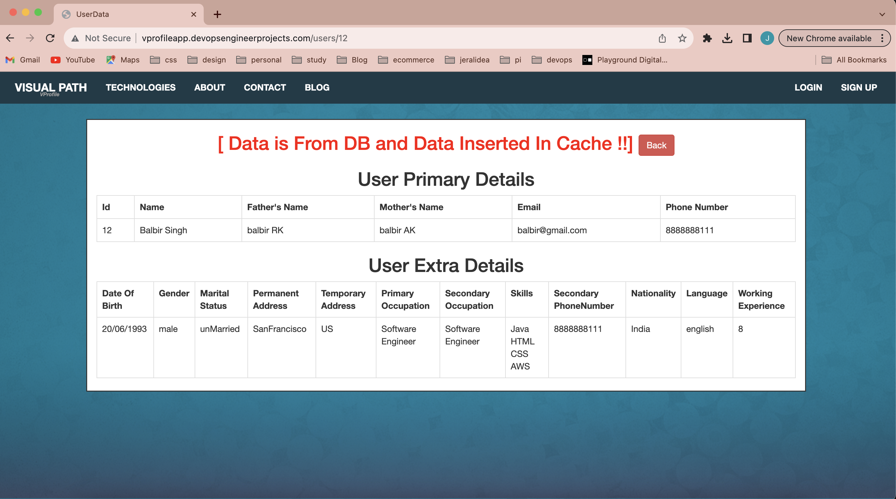
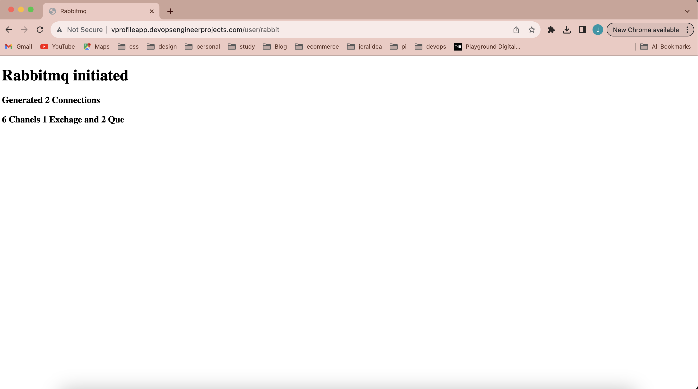

# Building My DevOps Portfolio 🚀

## Project 2: Lift and Shift Application Workload

One of the benefits of working at EY is Udemy for Business. I decided to enroll in the course 'DevOps Projects | 20 Real-Time DevOps Projects' to enhance my DevOps portfolio and share this process for educational purposes.
### About:

- ✅ **Previous Project:** Multi-Tier Web Application Stack (Profile).
- ✅ **Hosting:** AWS Cloud for Production.
- ✅ **Strategy:** Lift and Shift.

### Scenario:
- 👩🏽‍💻 Application services were running on physical/virtual machines.
- 👩🏽‍💻 Workload was residing in our datacenter.
- 👩🏽‍💻 Multiple teams were collaborating around the cloud, including the Virtualization team, Data Center Operations team, Monitoring team, and Sysadmin team.

### Challenges:
- ❌ **Complex Management:** Dealing with services and teams was a challenge.
- ❌ **Scaling Complexity:** Frequent scale up/down requirements.
- ❌ **Cost Structure:** Upfront CapEx and regular OpEx.
- ❌ **Manual Processes:** Lengthy and prone to errors.
- ❌ **Automation Difficulty:** Challenges in automating tasks.
- ❌ **Time-Consuming:** Processes were taking too much time.

### Solution:
- ✅ **Cloud Setup:** Transformed to a cloud-based infrastructure.
- ✅ **Pay-as-You-Go:** Flexible cost structure.
- ✅ **IAAS:** Infrastructure as a Service.
- ✅ **Flexibility:** Enhanced adaptability.
- ✅ **Simplified Management:** Ease of infrastructure management.
- ✅ **Automation:** Reduced human errors through automation.

### Leveraging AWS Services:

- 🎯 **Flexible Infrastructure:** Adapt to changing demands.
- 🎯 **Cost Efficiency:** Eliminated upfront costs.
- 🎯 **Modernization:** Utilizing AWS Services for effective modernization.
- 🎯 **IAAC:** Adopting Infrastructure as Code.

### AWS Architecture for the Project:

- ☁️ **EC2 Instances:** VMs for TOMCAT, RABBITMQ, MEMCACHE, MYSQL.
- ☁️ **ELB:** Nginx Load Balancer Replacement.
- ☁️ **Autoscaling:** Dynamic resource scaling.
- ☁️ **EFS / S3:** Shared storage solutions.
- ☁️ **Route 53:** Private DNS Service.

### Flow of Execution:
1. ⏭️ **Login to AWS Account**
2. ⏭️ **Create Key Pairs**
3. ⏭️ **Create Security Groups**
4. ⏭️ **Launch Instances with User Data (Bash Scripts)**
5. ⏭️ **Update IP-to-Name Mapping in Route 53**
6. ⏭️ **Build Application from Source Code**
7. ⏭️ **Upload to S3 Bucket**
8. ⏭️ **Download the Artifact to Tomcat EC2 Instance**
9. ⏭️ **Set up ELB with HTTPS (Certificate from Amazon Certificate Manager)**
10. ⏭️ **Map ELB Endpoint with Website Name in Godaddy DNS**
11. ⏭️ **Verify**

### GitHub Repository:

[https://github.com/jeraldinnemg/vprofile-project-2](https://github.com/jeraldinnemg/vprofile-project-2)

### Udemy Course:
[DevOps Projects | 20 Real-Time DevOps Projects](https://www.udemy.com/course/devopsprojects/)

## Automated Provisioning of the infrastructure evidence.

# Prerequisites
#
- JDK 1.8 or later
- Maven 3 or later
- MySQL 5.6 or later

# Technologies 
- Spring MVC
- Spring Security
- Spring Data JPA
- Maven
- JSP
- MySQL
# Database
Here,we used Mysql DB 
MSQL DB Installation Steps for Linux ubuntu 14.04:
- $ sudo apt-get update
- $ sudo apt-get install mysql-server

Then look for the file :
- /src/main/resources/accountsdb
- accountsdb.sql file is a mysql dump file.we have to import this dump to mysql db server
- > mysql -u <user_name> -p accounts < accountsdb.sql

